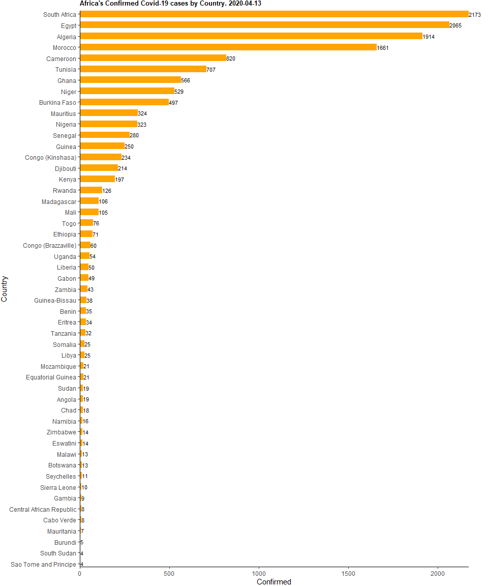
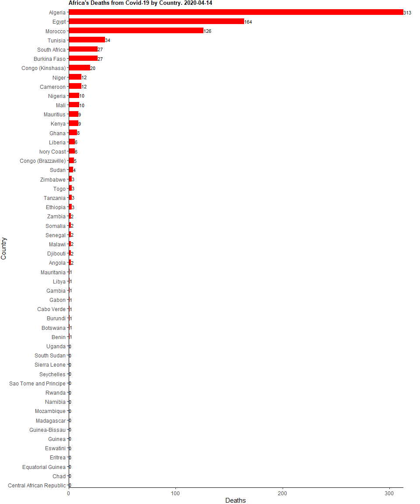
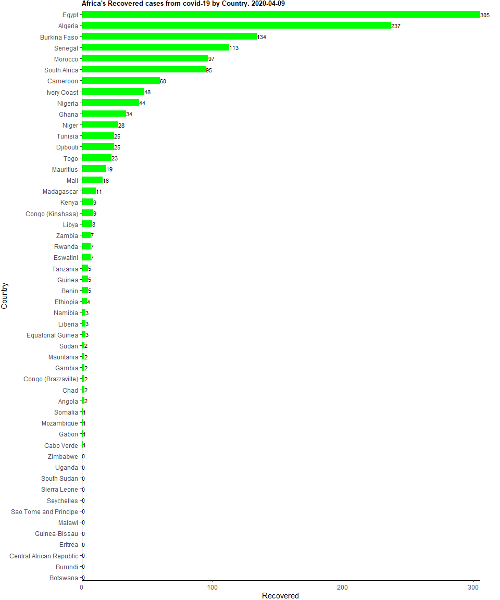

## Background
Late in December 2019, the [World Health Organisation](https://www.who.int/emergencies/diseases/novel-coronavirus-2019/events-as-they-happen) (WHO) China Country Office obtained information about a severe pneumonia of an unknown cause, detected in the city of Wuhan in Hubei province, China. This later turned out to be the **novel coronavirus disease** (COVID-19), an infectious disease caused by **severe acute respiratory syndrome coronavirus-2** (SARS-CoV-2) of the corona virus family. The disease causes respiratory illness characterised by primary [symptoms](https://www.cdc.gov/coronavirus/2019-ncov/symptoms-testing/symptoms.html) like cough, fever, and in more acute cases, difficulty in breathing. **WHO** later [declared covid-19 as a Pandemic](https://time.com/5791661/who-coronavirus-pandemic-declaration/) because of its fast rate of spread across the Globe with over [1.78 Million confirmed cases and over 108,000 deaths](https://coronavirus.jhu.edu/map.html) as of April 12, 2020. The African continent confirmed its first cases in Mid February 2020 in some countries. The disease has since spread across 52 of the 54 Africa countries with over [13,000 confirmed cases and over 700 deaths](https://africanarguments.org/2020/04/07/coronavirus-in-africa-tracker-how-many-cases-and-where-latest/) as of April 12, 2020. 

## The Dataset
The [covid_19_africa.csv](https://github.com/ju-ok/Covid-19-Africa.git) dataset contains daily level information about the Covid-19 cases in Africa.
It is a time series data and hence the number of cases on any given day is cumulative.I extracted the data from the [covid_19_data.csv](https://www.kaggle.com/sudalairajkumar/novel-corona-virus-2019-dataset#covid_19_data.csv) which was made available on kaggle. The R scriptthat I used to prepare this dataset is also available on [my Github repository](https://github.com/ju-ok/Covid-19-Africa.git). The original datasets can be found on [John Hopkins University Github repository](https://github.com/CSSEGISandData/COVID-19/tree/master/csse_covid_19_data/csse_covid_19_daily_reports) for covid_19. 

### Field description
- ObservationDate: YY/MM/DD
- Country: name of African country
- Confirmed: the number of covid-19 confirmed cases
- Deaths:  the number of deaths from covid-19
- Recovered: the number of recovered cases

## Task
- Visualizations of Africa’s covid-19 confirmed cases, deaths, and recovered cases by country. 

Define a general figure size for all plots

```r
knitr::opts_chunk$set(fig.width=10, fig.height=12) 
```

## Data processing
Loading the required packages and setting a general theme for all the plots.

```r
suppressMessages(library(tidyverse))
```

```
## Warning: package 'ggplot2' was built under R version 3.6.3
```

```r
suppressMessages(library(lubridate))
theme_set(theme_classic())
```

Importing the dataset

```r
(covid_africa <- read_csv("covid_19_africa.csv"))
```

```
## Parsed with column specification:
## cols(
##   ObservationDate = col_date(format = ""),
##   Country = col_character(),
##   Confirmed = col_double(),
##   Deaths = col_double(),
##   Recovered = col_double()
## )
```

```
## # A tibble: 1,409 x 5
##    ObservationDate Country     Confirmed Deaths Recovered
##    <date>          <chr>           <dbl>  <dbl>     <dbl>
##  1 2020-01-27      Ivory Coast         1      0         0
##  2 2020-02-14      Egypt               1      0         0
##  3 2020-02-15      Egypt               1      0         0
##  4 2020-02-16      Egypt               1      0         0
##  5 2020-02-17      Egypt               1      0         0
##  6 2020-02-18      Egypt               1      0         0
##  7 2020-02-19      Egypt               1      0         0
##  8 2020-02-20      Egypt               1      0         0
##  9 2020-02-21      Egypt               1      0         0
## 10 2020-02-22      Egypt               1      0         0
## # ... with 1,399 more rows
```

Converting the classes of Confirmed, Deaths, and Recovered columns to class integer.

```r
(covid_africa <- covid_africa %>%
        
        mutate(Confirmed = as.integer(Confirmed), 
               Deaths = as.integer(Deaths),
               Recovered = as.integer(Recovered)))
```

```
## # A tibble: 1,409 x 5
##    ObservationDate Country     Confirmed Deaths Recovered
##    <date>          <chr>           <int>  <int>     <int>
##  1 2020-01-27      Ivory Coast         1      0         0
##  2 2020-02-14      Egypt               1      0         0
##  3 2020-02-15      Egypt               1      0         0
##  4 2020-02-16      Egypt               1      0         0
##  5 2020-02-17      Egypt               1      0         0
##  6 2020-02-18      Egypt               1      0         0
##  7 2020-02-19      Egypt               1      0         0
##  8 2020-02-20      Egypt               1      0         0
##  9 2020-02-21      Egypt               1      0         0
## 10 2020-02-22      Egypt               1      0         0
## # ... with 1,399 more rows
```


Checking and confirming the number of African countries with confirmed cases. 
At the time of updating this script, only 52 of the 54 African countries recognized by the UN and WHO had confirmed cases.

```r
length(unique(covid_africa$Country))
```

```
## [1] 52
```

Obtaining the most recent cases in each country. 
Note that the most recent cases on a given day == cumulative sum of cases reportd by end of the previous day. **WARNING: Adjust "today() - 1" accordingly.**

```r
(latest <- covid_africa %>%
        filter(ObservationDate == today() - 1 ))
```

```
## # A tibble: 51 x 5
##    ObservationDate Country                  Confirmed Deaths Recovered
##    <date>          <chr>                        <int>  <int>     <int>
##  1 2020-04-11      Algeria                       1825    275       460
##  2 2020-04-11      Angola                          19      2         4
##  3 2020-04-11      Benin                           35      1         5
##  4 2020-04-11      Botswana                        13      1         0
##  5 2020-04-11      Burkina Faso                   484     27       155
##  6 2020-04-11      Burundi                          5      0         0
##  7 2020-04-11      Cabo Verde                       8      1         1
##  8 2020-04-11      Cameroon                       820     12        98
##  9 2020-04-11      Central African Republic         8      0         0
## 10 2020-04-11      Chad                            11      0         2
## # ... with 41 more rows
```

## VISUALIZATIONS OF COVID-19 CASES IN AFRICA
Visualization of confirmed cases by country.

```r
(latest_confirmed <- latest %>%
                
                # reordering the countries by number of confirmed cases i.e highest to lowest
                mutate(Country = fct_reorder(Country, Confirmed)) %>%
                
                # specifying the values on the x and y axes 
                ggplot(aes(x = Country, y = Confirmed)) +
                
                # setting parameters for the bar plots of confirmed cases by country
                geom_bar(stat = "identity", show.legend = FALSE, fill = "orange", width = 0.6) + 
                
                # specifying and positioning of the bar labels
                geom_text(aes(label = Confirmed), hjust =  0, size = 3) +
                
                # flipping the x and y co-ordinates
                coord_flip(clip = "off", expand = FALSE) +
                
                # specifying desired parameters for the plot title and margin
                theme(plot.title = element_text(hjust = 0, size = 10, face = "bold"),
                      plot.margin = margin(0, 1, 0, 0, unit = "cm")) +
                
                # specifying the plot title
                labs(title = "Africa's Confirmed Covid-19 cases by Country. 2020-04-12"))
```

<!-- -->

Visualization of confirmed deaths by country.

```r
(latest_deaths <- latest %>%
                
                # reordering the countries by number of confirmed deaths i.e highest to lowest
                mutate(Country = fct_reorder(Country, Deaths)) %>%
                
                # specifying the values on the x and y axes 
                ggplot(aes(x = Country, y = Deaths)) +
                
                # setting parameters for the bar plots of confirmed deaths by country
                geom_bar(stat = "identity", show.legend = FALSE, fill = "red", width = 0.6) +
                
                # specifying and positioning of the bar labels
                geom_text(aes(label = Deaths), hjust =  0, size = 3) +
                
                # flipping the x and y co-ordinates
                coord_flip(clip = "off", expand = FALSE) +
                
                # specifying desired parameters for the plot title and margin
                theme(plot.title = element_text(hjust = 0, size = 10, face = "bold"),
                      plot.margin = margin(0, 1, 0, 0, unit = "cm")) +
                
                # specifying the plot title
                labs(title = "Africa's Deaths from Covid-19 by Country. 2020-04-12"))
```

<!-- -->

Visualization of recovered cases by country.

```r
(latest_recovered <- latest %>%
                
                # reordering the countries by number of recovered cases i.e highest to lowest
                mutate(Country = fct_reorder(Country, Recovered)) %>%
                
                #  specifying the values on the x and y axes 
                ggplot(aes(x = Country, y = Recovered)) +
                
                # setting parameters for the bar plots of confirmed recoveries by country
                geom_bar(stat = "identity", show.legend = FALSE, fill = "green", width = 0.6) + 
                
                # specifying and positioning of the bar labels
                geom_text(aes(label = Recovered), hjust =  0, size = 3) +
                
                # flipping the x and y  co-ordinates
                coord_flip(clip = "off", expand = FALSE) +
                
                # specifying desired parameters for the plot title and margin
                theme(plot.title = element_text(hjust = 0, size = 10, face = "bold"),
                      plot.margin = margin(0, 1, 0, 0, unit = "cm")) +
                
                # specifying the plot title
                labs(title = "Africa's Recovered cases from covid-19 by Country. 2020-04-12"))
```

<!-- -->

latest sum of confirmed cases, Deaths, and recovered cases in Africa.

```r
sum(latest$Confirmed); sum(latest$Deaths); sum(latest$Recovered)
```

```
## [1] 13094
```

```
## [1] 738
```

```
## [1] 2300
```

Date of last update of script and session information

```r
# date of last update of Rmd
today()
```

```
## [1] "2020-04-12"
```

```r
# session information
sessionInfo()
```

```
## R version 3.6.2 (2019-12-12)
## Platform: x86_64-w64-mingw32/x64 (64-bit)
## Running under: Windows 10 x64 (build 18362)
## 
## Matrix products: default
## 
## locale:
## [1] LC_COLLATE=English_United States.1252 
## [2] LC_CTYPE=English_United States.1252   
## [3] LC_MONETARY=English_United States.1252
## [4] LC_NUMERIC=C                          
## [5] LC_TIME=English_United States.1252    
## 
## attached base packages:
## [1] stats     graphics  grDevices utils     datasets  methods   base     
## 
## other attached packages:
##  [1] lubridate_1.7.4 forcats_0.4.0   stringr_1.4.0   dplyr_0.8.4    
##  [5] purrr_0.3.3     readr_1.3.1     tidyr_1.0.2     tibble_2.1.3   
##  [9] ggplot2_3.3.0   tidyverse_1.3.0
## 
## loaded via a namespace (and not attached):
##  [1] tidyselect_1.0.0 xfun_0.12        haven_2.2.0      lattice_0.20-40 
##  [5] colorspace_1.4-1 vctrs_0.2.3      generics_0.0.2   htmltools_0.4.0 
##  [9] yaml_2.2.1       utf8_1.1.4       rlang_0.4.4      pillar_1.4.3    
## [13] glue_1.3.1       withr_2.1.2      DBI_1.1.0        dbplyr_1.4.2    
## [17] modelr_0.1.5     readxl_1.3.1     lifecycle_0.1.0  munsell_0.5.0   
## [21] gtable_0.3.0     cellranger_1.1.0 rvest_0.3.5      evaluate_0.14   
## [25] labeling_0.3     knitr_1.28       fansi_0.4.1      broom_0.5.4     
## [29] Rcpp_1.0.3       scales_1.1.0     backports_1.1.5  jsonlite_1.6.1  
## [33] farver_2.0.3     fs_1.3.1         hms_0.5.3        digest_0.6.24   
## [37] stringi_1.4.3    grid_3.6.2       cli_2.0.1        tools_3.6.2     
## [41] magrittr_1.5     crayon_1.3.4     pkgconfig_2.0.3  ellipsis_0.3.0  
## [45] xml2_1.2.2       reprex_0.3.0     assertthat_0.2.1 rmarkdown_2.1   
## [49] httr_1.4.1       rstudioapi_0.11  R6_2.4.1         nlme_3.1-144    
## [53] compiler_3.6.2
```

## References
1. John Hopkins University Covid_19 datasets: 
https://github.com/CSSEGISandData/COVID-19/tree/master/csse_covid_19_data/csse_covid_19_daily_reports
2. SRk's dataset on kaggle: https://www.kaggle.com/sudalairajkumar/novel-corona-virus-2019-dataset#covid_19_data.csv
3. African Arguments, Covid-19 Africa Tracker: 
https://africanarguments.org/2020/04/07/coronavirus-in-africa-tracker-how-many-cases-and-where-latest/


